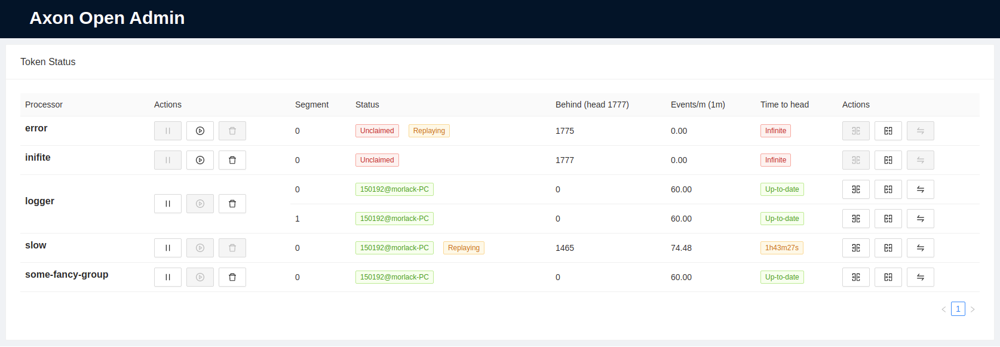

# Axon Open Admin


Axon Framework is a great CQRS/Event-Sourcing library. However, it comes with little to no built-in support for managing your tracking tokens or event store. 
This project aims to fix that problems and provides an administration interface without requiring additional deployments. Just add the Spring Boot starter and it works out of the box.




Note that this is a project currently in its initial development. Except a lot of changes, new versions and added features. Do you want to contribute? Always great! Look in the issues for all the things on the roadmap. 

## How to install

Add the following dependency to your maven project:

```
<dependency>
    <groupId>com.insidion</groupId>
    <artifactId>axon-open-admin</artifactId>
    <version>${axon-open-admin.version}</version>
</dependency>
```

When your application now boots you can access the administration interface at `/(your-context-path)/axon-admin/`. Enjoy!

## Considerations
There are a few things to keep in mind if you are planning on using this library:

- It only supports Axon 4.4. I am currently not planning on supporting older versions, since the working of this library depend on some of the private API of Axon Framework.
- The library will put some load on your token table, although it isn't much unless tons of people have the window open at the same time. Improving this is high on the roadmap
