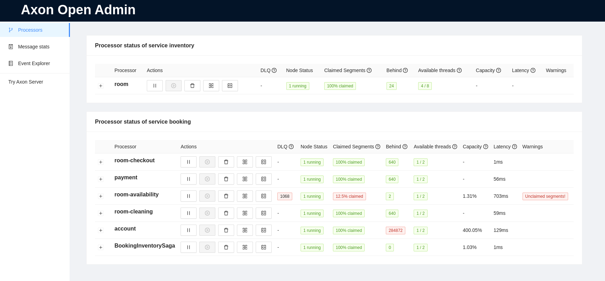
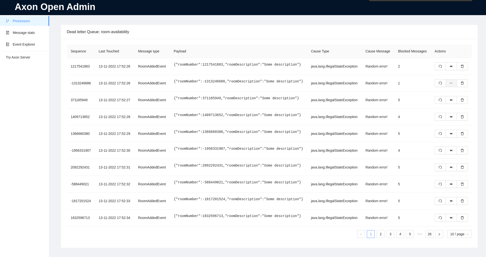
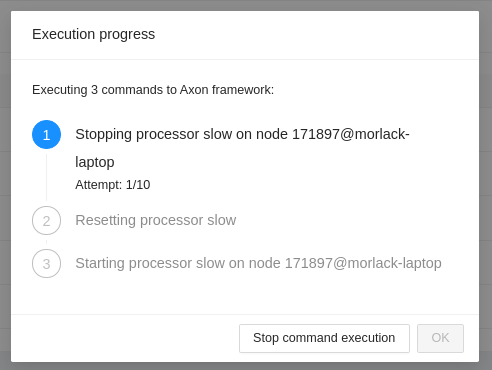
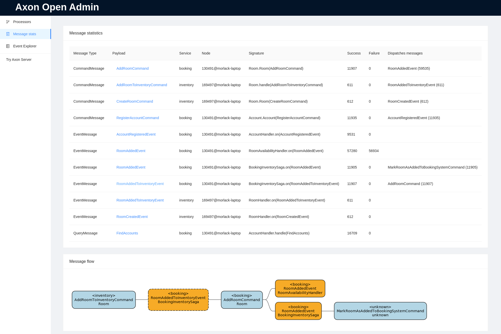
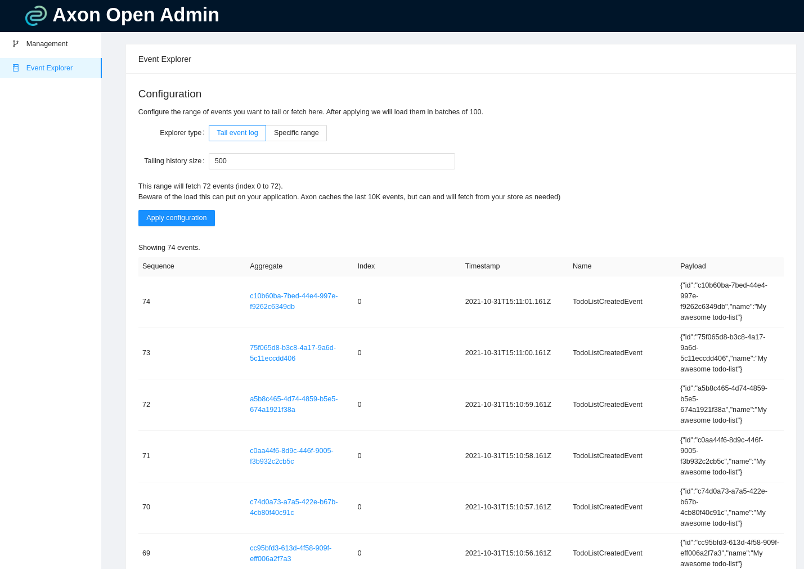

# Axon Open Admin

[Axon Framework](https://developer.axoniq.io/axon-framework/overview) is one of the best CQRS/ES frameworks in the
market today.
And with Axon Open Admin, the management your Axon Framework application becomes much easier.

## Features

After including this Spring Boot 2 starter in your application it will allow you to:

- Pause/resume event processor
- Split and merge segments
- Trigger Replays
- Detect malfunctions and show them to you
  - Unclaimed tokens
  - Multiple token stores
  - Token stealing
  - Thread starvation in your processors
- Easily show you metrics in the right places
- Give you insight into how different messages correlate to each other

### Processor management

This is the main overview of your application. It shows the segments that are currently being processed by what nodes.
The screen allows you to manage each processor: start/stop the processor, split/merge segments or replay the event
processor.



### Dead-Letter Queue insight and actions

When a DLQ is configured for a processor, you can explore the items in the DLQ and take actions. You can delete the
entire sequence,
retry the entire sequence, or evict the first message of the sequence and retry the others.



When a DLQ is configured, starting a replay will give you the option to clear the queue. The framework does not do this
by default.

### Actions

The application is smart enough to determine what actions need to be taken to achieve a desired result.
It will show you the progress.



### Decentralized

There is no central backend that acts as a central communication node. The starter is built
so that no additional deployment is needed in your infrastructure.

The calls that are handled by the starter's backend are highly performant, allowing the front-end to poll
in quick succession without big penalties.
When all nodes of an application is behind a round-robin load balancer,
it's able to pick them all up quickly.

When you want to execute a certain action from the interface, the command is sent with the chosen node in mind.
If it hits, great! If it doesn't, it tries again. This way the starter works without a
designated backend, but all nodes need to be reachable on the base url using a round-robin load balancer.

### Multiservice aware

It's useful to have multiple of the services in your landscape managed by the same Axon Admin, especially if they send
messages to each other. Axon Open Admin will provide you insight into the flow of your messages between them if you do
so.



By default, it will poll the service you have included the starter in.
You can include additional ones, providing the name and one or more urls at which they can be reached.
The syntax is `axon.admin.servers.[service_name]=[comma_separated_urls]`.

```properties
axon.admin.servers.booking=http://my-awesome-domain.com/booking/axon-admin
axon.admin.servers.inventory=http://my-awesome-domain.com/inventory/axon-admin,http://my-awesome-domain.com/inventory2/axon-admin
```

Note that the urls must be reachable from your browser. When multiple URLs are configured, the first successful one will
be used.

## Event Exploration

You can also explore your Eventstore in Axon Admin. You can either tail the event log (last x events), can specify
a date range to retrieve or find the events of your aggregate.



# How to install

Add the following dependency to your maven project:

```
<dependency>
    <groupId>com.insidion</groupId>
    <artifactId>axon-open-admin-starter</artifactId>
    <version>0.2.3</version>
</dependency>
```

When your application now boots you can access the administration interface at `/(your-context-path)/axon-admin/`.
If you are unsure, the boot log of your application will contain the precise path.
Enjoy!

We recommend configuring Spring Boot Security to secure these endpoints, as they are open to abuse.

# Considerations

There are a few things to keep in mind if you are planning on using this library:

- It only supports Axon 4.6. We are currently not planning on supporting older versions
- There is a known issue with `spring-boot-devtools`. With devtools enabled your application will fail to boot.
- All nodes need to be reachable from the front-end you are accessing.
  If some other node is behind another load balancer, the application will not be able to take actions.

# Notable references

I started Axon Open Admin while working at [codecentric Netherlands](https://codecentric.nl). I want to thank them for
the time they let me put into it!

In addition, at codecentric we blog about certain challenges or opportunities we encounter when using Axon Framework.
Currently, we have the following published:

- [Replaying for a single aggregate in Axon Framework](https://blog.codecentric.nl/mitchellherrijgers/replaying-for-a-single-aggregate-in-axon-framework-126m)
- [Dealing with personal data in Axon Framework](https://blog.codecentric.nl/mitchellherrijgers/axon-framework-dealing-with-personal-data-3amp)
- [Taking advantage of Metadata in Axon Framework](https://blog.codecentric.nl/mitchellherrijgers/taking-advantage-of-metadata-in-axon-framework-3da9)

Take a look if you're interested. Happy reading!

