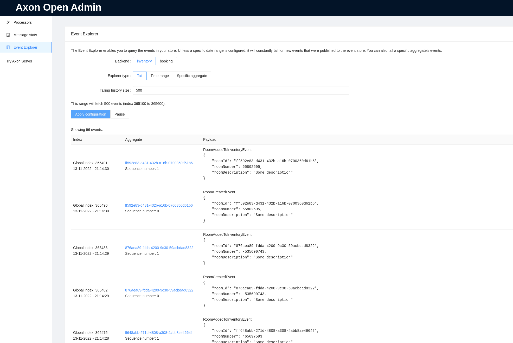

# Axon Open Admin

Do you also love using [Axon Framework](https://developer.axoniq.io/axon-framework/overview) for your CQRS applications?
I do! 

AxonIQ provides Axon Server as an Event storage solution. It also provides an easy method to look into your event store
and to manager tracking tokens for your projections. Without Axon server, this becomes a tedious, manual proces. This
Spring Boot Starter takes care of that!

Axon Open Admin hooks into the JPA or Jdbc token store and lets you manage the containing tokens, such as splitting
them, merging them, and starting replays. Clone the project and fire up the demo to see it in real life, or just add the
Starter to your Spring Boot application!

## Overview

This is the main overview of your application. It shows the tracking tokens, which node claimed it and how fast it is
progressing through the events. You can click on the designated buttons to start certain actions.


The application is smart enough to determine what actions need to be taken to achieve a desired result, like you see in
the next image.


The starter has no backend and this is intentional. When it wants `node x` to do something, it will send a command as
HTTP request aimed at that node. If it hits, great! If it doesn't, it tries again. This way the starter works without a
designated backend, but all nodes need to be reachable on the base url using a round-robin load balancer.

## Event Exploration

You can also explore you Eventstore in Axon Admin. You can either tail the event log (last x events) or you can specify
a date range to retrieve.



The date range preview also comes with an approximation how many events will be retrieved.


Searching inside events is currently not supported, but raise an issue if you'd like that functionality.

# How to install

Add the following dependency to your maven project:

```
<dependency>
    <groupId>com.insidion</groupId>
    <artifactId>axon-open-admin-starter</artifactId>
    <version>0.1.0</version>
</dependency>
```

When your application now boots you can access the administration interface at `/(your-context-path)/axon-admin/`.
Enjoy!

We recommend configuring Spring Boot Security to secure these endpoints, as they are open to abuse.

# Considerations

There are a few things to keep in mind if you are planning on using this library:

- It only supports Axon 4.5. We are currently not planning on supporting older versions, since the working of this
  library depends on the private API of Axon Framework at the moment.
- There is a known issue with `spring-boot-devtools`. With devtools enabled your application will fail to boot.
- All nodes need to be reachable from the front-end you are accessing. If some other node is behind another load
  balancer, the application will not be able to take actions.

# Notable references

I started Axon Open Admin while working at [codecentric Netherlands](https://codecentric.nl). I want to thank them for
the time they let me put into it!

In addition, at codecentric we blog about certain challenges or opportunities we encounter when using Axon Framework.
Currently, we have the following published:

- [Replaying for a single aggregate in Axon Framework](https://blog.codecentric.nl/mitchellherrijgers/replaying-for-a-single-aggregate-in-axon-framework-126m)
- [Dealing with personal data in Axon Framework](https://blog.codecentric.nl/mitchellherrijgers/axon-framework-dealing-with-personal-data-3amp)
- [Taking advantage of Metadata in Axon Framework](https://blog.codecentric.nl/mitchellherrijgers/taking-advantage-of-metadata-in-axon-framework-3da9)

Take a look if you're interested. Happy reading!

